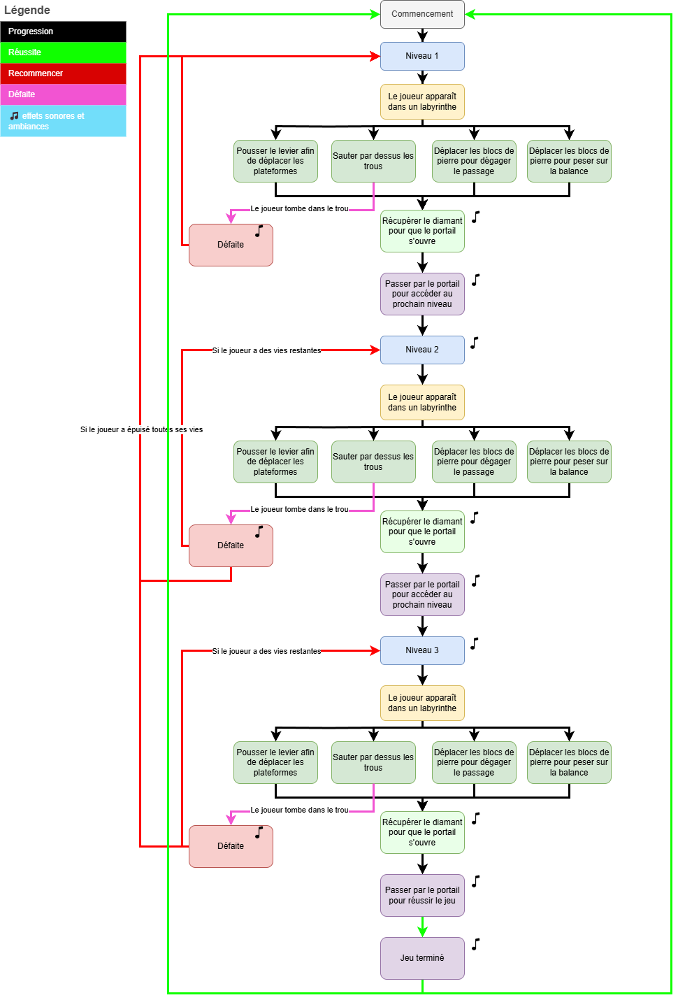

# OS'SCAPE

Incarnez un squelette prisonnier d’un labyrinthe dangereux en réalité virtuelle, et échappez-vous en évitant pièges et obstacles à travers trois niveaux de difficulté croissante.

## Description spécifique

Une expérience VR immersive où le joueur rentre dans la peau d'un squelette se retrouvant prisonnier dans un labyrinthe. Pour s'en sortir, il devra comprendre les différents mécanismes du jeu, ainsi qu'éviter des pièges mortels à travers trois niveaux. Chaque niveau propose un labyrinthe unique, et le joueur devra récupérer un diamant bien caché pour pouvoir passer au suivant, et, finalement, pouvoir en sortir. La difficulté augmente graduellement au fil des niveaux : les pièges deviennent plus complexes, les mécanismes plus nombreux et le labyrinthe plus difficile à naviguer.

Durant la phase d’introduction, le joueur apprend les contrôles de base et les mécaniques essentielles qui lui permettront de progresser dans le jeu : comment interagir avec les objets, éviter les pièges et recupéper les objets requis pour passer à la prochaine étape.

Exemples de pièges et de mécanismes:
* Le joueur devra déplacer des blocs de pierre qui bloqueront son chemin ou pour agir en tant que poids sur une balance.
* Le joueur aura des leviers à actionner afin de continuer sa progression.
* Le joueur devra éviter les trous sur le sol.
* Le joueur a trois vies au total et s'il les perd toutes, il devra recommencer du début peu importe sa progression actuelle.

## Moodboard visuel

## Moodboard sonore
### Ambiance sonore

♫
♫
♫

### Effets sonores

♫ [Récolte d'un diamant](https://pixabay.com/sound-effects/diamond-found-190255/)
♫ [Saut](https://pixabay.com/sound-effects/toy-button-105724/))
♫ [Levier](https://pixabay.com/sound-effects/wood-crack-1-105890/) pas sur de lui, genre la premiere partie, tell me if u find sm better
♫ [Déplacement de la roche](https://pixabay.com/sound-effects/pushing-chair-96107/)

## Carte environnementale

## Schema intéractivité

